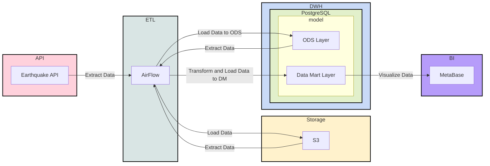

# Pet_project_earthquake
Проект получает данные о землетрясениях через API, отправляет в Data Lake (s3)
# Data Governance

#Data Srhitect

### 1. Data Architecture

```mermaid
flowchart LR
    subgraph API
        direction LR
        API_E["Earthquake API"]
    end

    subgraph ETL
        direction LR
        AirFlow
    end

    subgraph Storage
        direction LR
        S3
    end

    subgraph DWH
        direction LR
        subgraph PostgreSQL
            direction LR
            subgraph model
                direction LR
                ods["ODS Layer"]
                dm["Data Mart Layer"]
            end
        end
    end

    subgraph BI
        direction LR
        MetaBase
    end

    API_E -->|Extract Data| AirFlow
    AirFlow -->|Load Data| S3
    S3 -->|Extract Data| AirFlow
    AirFlow -->|Load Data to ODS| ods
    ods -->|Extract Data| AirFlow
    AirFlow -->|Transform and Load Data to DM| dm
    dm -->|Visualize Data| MetaBase
    style API fill: #FFD1DC, stroke: #000000, stroke-width: 2px
    style ETL fill: #D9E5E4, stroke: #000000, stroke-width: 2px
    style Storage fill: #FFF2CC, stroke: #000000, stroke-width: 2px
    style DWH fill: #C9DAF7, stroke: #000000, stroke-width: 2px
    style PostgreSQL fill: #E2F0CB, stroke: #000000, stroke-width: 2px
    style BI fill: #B69CFA, stroke: #000000, stroke-width: 2px

```
